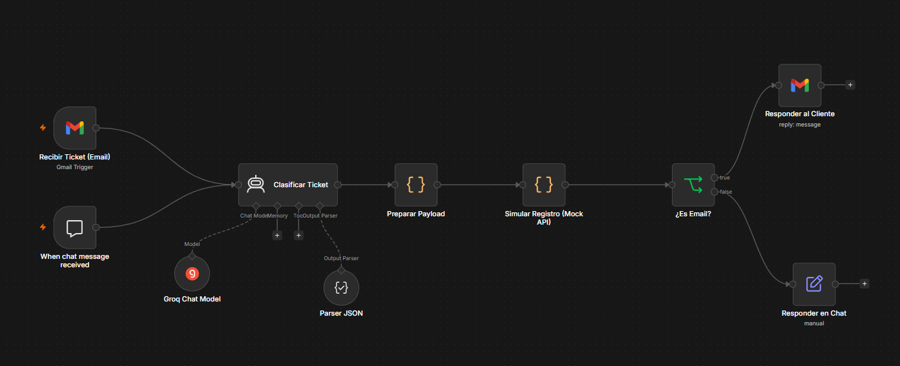

<div align="center">

# 🎫 AuroraFlow


</div>

**AuroraFlow** es una API REST de trazabilidad de triage de tickets de soporte.

Un flujo externo en **n8n** recibe el ticket (correo o chat), lo clasifica con un **LLM** y envía a la
API el texto, el canal, la **categoría** y la **severidad**. La API **no clasifica texto**: deriva de
forma determinista el **equipo destino** y el **SLA** (incluidas las fechas límite), persiste el
registro y lo deja consultable.

> **Frontera de responsabilidad:** categoría y severidad son autoridad de n8n; equipo y SLA son
> autoridad de la API.

📄 Workflow de n8n exportado: [`n8n-workflow/Aurora - Triage de Tickets.json`](n8n-workflow/Aurora%20-%20Triage%20de%20Tickets.json) — ver [detalle abajo](#-workflow-de-n8n).


---

## 📋 Reglas de negocio

**Categoría → equipo destino**

| Categoría         | Equipo        |
|-------------------|---------------|
| Facturación       | Finanzas      |
| Acceso y Cuentas  | Identity      |
| Rendimiento       | Plataforma    |
| Integraciones     | Integraciones |
| Datos y reportes  | Datos         |
| Interfaz / uso    | Producto      |

**Severidad → SLA**

| Severidad        | Respuesta | Resolución      |
|------------------|-----------|-----------------|
| Crítica          | 1 hora    | 4 horas         |
| Alta             | 4 horas   | 24 horas        |
| Media            | 4 horas   | 72 horas        |
| Baja             | 24 horas  | 10 días hábiles |
| Fuera de alcance | Redirigir | No aplica       |

- `responseDeadline` = `receivedAt` + horas de respuesta.
- `resolutionDeadline` = `receivedAt` + tiempo de resolución.
- **Baja**: los 10 días hábiles saltan sábados y domingos (festivos aún no contemplados).
- **Fuera de alcance**: sin fechas límite, ambos deadlines en `null`.

Todas las fechas son `Instant` en UTC.

---

## ⚙️ Stack

| Capa        | Tecnología                                                  | Propósito                 |
|-------------|-------------------------------------------------------------|---------------------------|
| Backend     | Java 21, Spring Boot 3.3, Spring Data JPA / Hibernate        | API REST y persistencia   |
| Backend     | MapStruct, Lombok, Jakarta Validation, SpringDoc OpenAPI     | Mapeo, DTOs, documentación|
| Backend     | JUnit 5 + Mockito                                            | Tests                     |
| Datos       | PostgreSQL 16                                                | Almacén operacional       |
| Automatización | n8n + Groq *(externo)*                                    | Clasificación del ticket  |
| Infra local | Docker Compose                                               | API + base de datos       |

---

## 📡 Endpoints

Inventario completo en Swagger: `/swagger-ui.html` · OpenAPI: `/v3/api-docs`.

| Método | Ruta                    | Descripción                                          |
|--------|-------------------------|------------------------------------------------------|
| `POST` | `/api/v1/tickets`       | Registra un ticket ya clasificado y deriva equipo y SLA |
| `GET`  | `/api/v1/tickets/{id}`  | Recupera un ticket por su id                          |
| `GET`  | `/api/v1/tickets`       | Histórico paginado, ordenado por `receivedAt` desc    |

Filtros del histórico: `category`, `severity`, `team`, `source`, `from`, `to`, `page`, `size`.
Los valores fuera del contrato devuelven `400`; un id inexistente devuelve `404`.

**Ejemplo**

```bash
curl -X POST http://localhost:8080/api/v1/tickets \
  -H "Content-Type: application/json" \
  -d '{
    "source": "EMAIL",
    "text": "Desde esta mañana nadie de mi equipo puede iniciar sesión",
    "category": "Acceso y Cuentas",
    "severity": "Crítica",
    "receivedAt": "2026-09-18T08:00:00Z"
  }'
```

```json
{
  "id": "1142cb3b-2486-40d7-aa8a-a7cc8e7c45a0",
  "category": "Acceso y Cuentas",
  "severity": "Crítica",
  "team": "Identity",
  "sla": {
    "responseTarget": "1 hora",
    "resolutionTarget": "4 horas",
    "responseDeadline": "2026-09-18T09:00:00Z",
    "resolutionDeadline": "2026-09-18T12:00:00Z"
  },
  "receivedAt": "2026-09-18T08:00:00Z",
  "createdAt": "2026-09-18T08:00:05Z"
}
```

---

## 🚀 Inicio rápido

### Con Docker

```bash
docker compose up --build
# API en http://localhost:8080 · Swagger en /swagger-ui.html
```

Levanta PostgreSQL 16 y la API. El servicio `app` espera a que la base pase su healthcheck
(`pg_isready`) antes de arrancar.

### Sin Docker

Requiere JDK 21 y una base PostgreSQL en ejecución.

```bash
export SPRING_DATASOURCE_URL=jdbc:postgresql://localhost:5432/aurora
export SPRING_DATASOURCE_USERNAME=postgres
export SPRING_DATASOURCE_PASSWORD=postgres

./mvnw spring-boot:run
```

### Tests

```bash
./mvnw test
```

Los tests usan H2 en memoria: no requieren PostgreSQL.

---

## 🔗 Workflow de n8n



| Nodo                          | Tipo           | Qué hace                                                   |
|-------------------------------|----------------|------------------------------------------------------------|
| `Recibir Ticket (Email)`      | Gmail Trigger  | Entra un ticket por correo                                  |
| `When chat message received`  | Chat Trigger   | Entra un ticket por chat                                    |
| `Clasificar Ticket`           | AI Agent       | Deduce categoría y severidad del texto                      |
| `Groq Chat Model`             | Modelo         | LLM que respalda al agente                                  |
| `Parser JSON`                 | Output Parser  | Fuerza una salida estructurada                              |
| `Preparar Payload`            | Code           | Arma el cuerpo del `POST /api/v1/tickets`                   |
| `Simular Registro (Mock API)` | Code           | **Simula** el registro — ver "Pendiente de conectar"        |
| `¿Es Email?`                  | If             | Enruta la respuesta según el canal de origen                |
| `Responder al Cliente`        | Gmail          | Responde el correo                                          |
| `Responder en Chat`           | Chat           | Responde por chat                                           |

### ⚠️ Pendiente de conectar

El workflow **todavía no llama a la API real**. El nodo `Simular Registro (Mock API)` devuelve una
respuesta simulada, así que hoy ningún ticket llega a PostgreSQL desde n8n.

Para conectarlo, hay que reemplazar ese nodo por una petición HTTP:

| Campo        | Valor                                                              |
|--------------|--------------------------------------------------------------------|
| Tipo de nodo | HTTP Request                                                       |
| Método       | `POST`                                                             |
| URL          | `http://<host-de-la-api>:8080/api/v1/tickets`                      |
| Headers      | `Content-Type: application/json`                                   |
| Body         | La salida de `Preparar Payload`                                    |

El payload debe traer `source`, `text`, `category` y `severity`; `receivedAt` y `draftResponse` son
opcionales. Los campos `team` y `sla` **no** se envían: los deriva la API y vuelven en la respuesta
`201`, lista para redactar la contestación al cliente.

---

## 🙌 Equipo

- Tulio Riaño Sánchez
- Juan Sebastián Puentes Julio
- Daniel Patiño Mejia
- David Alejandro Patacon Henao

## 📄 Licencia

Distribuido bajo la **Licencia MIT** — ver [LICENSE](LICENSE).
